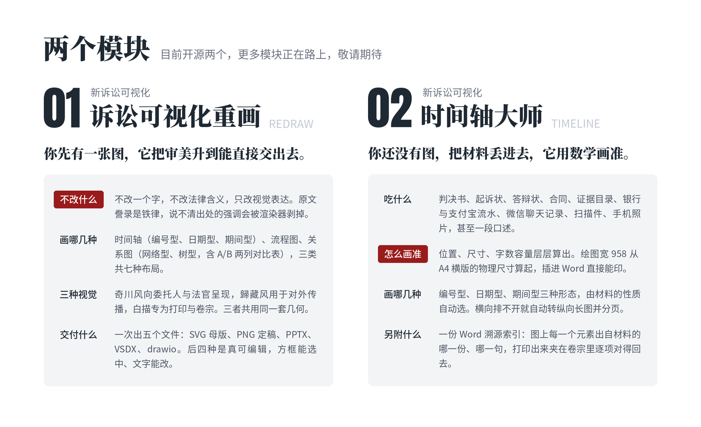
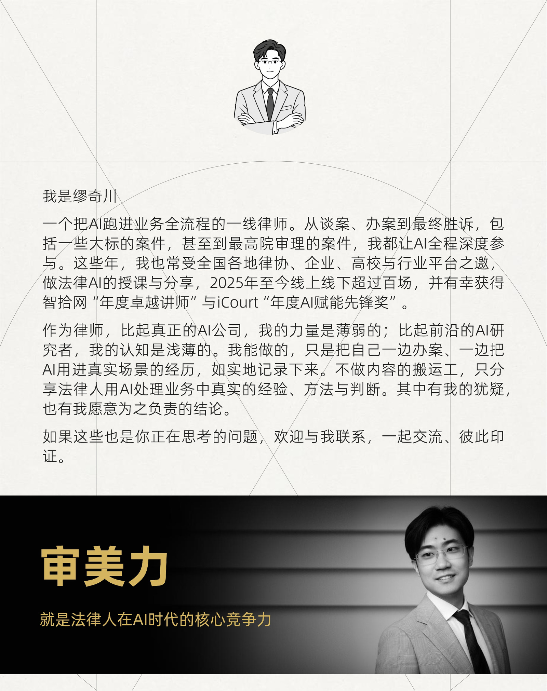

<p align="center">
  
</p>

<p align="center">
  <a href="LICENSE"></a>
  
  
  <a href="https://github.com/MiaoQichuan/new-litigation-visualization/actions/workflows/checks.yml"></a>
  
  
  
  
  
</p>

---

诉讼可视化不是新话题。真正变了的是方法：过去一张诉讼图能不能用，取决于画图的人有多少耐心、审美到什么水准、愿意在对齐和留白上花多少时间；换一个人画，就是另一张图。这个项目要换掉的正是这一层。

新诉讼可视化把作图拆成两段：模型只负责读懂材料的意思，把哪一句是事实、哪几句属于同一件事判断出来；位置、尺寸、层数、字数容量则全部交给确定性的脚本，从 A4 纸的物理尺寸一路算到每一张卡片能写几个字。难的那部分不在模型手里，所以同一份材料换谁跑、跑几次，出来都是同一张图，换一个更弱的模型也一样。图上的每一个字都必须能追回材料原句，只许删减、不许改写，承诺与约定不进主轴。**画图不是把法律变轻佻，而是把思考变透明。**

## 现在有什么

| 模块 | 状态 | 一句话 | 输入 | 输出 |
| --- | --- | --- | --- | --- |
| [**诉讼可视化重画**](plugins/mqc-nlv/skills/mqc-litigation-visual-redraw/) | v1.0.2 已发布 | 你先画一张，它升级审美 | 一张已有的图（手绘、截图、AI 生成、Mermaid、甚至一段纯文字） | SVG · PNG · PPTX · VSDX · drawio |
| [**时间轴大师**](plugins/mqc-nlv/skills/mqc-timeline-master/) | v2.0.1 已发布 | 直接吃材料，把经过画准 | 判决书 · 起诉状 · 答辩状 · 合同 · 证据目录 · 流水 · 聊天记录 · 扫描件 · 照片 · 口述 | 同上 + 溯源索引 Word |

<p align="center">
  
</p>

**支持 DeepSeek Harness。** 两个模块都是标准的 `SKILL.md` 目录，没有任何产品特定的胶水代码，凡是能读 skill 指令的 agent 都装得上：Claude Code、Codex、DeepSeek Harness、Cursor、Gemini CLI、Copilot、Cline、Aider。同一份仓库，不维护两套。

## 仓库结构

```
new-litigation-visualization/
├── assets/                       仓库封面
├── .claude-plugin/
│   └── marketplace.json          插件市场清单
├── plugins/
│   └── mqc-nlv/
│       ├── .claude-plugin/
│       │   └── plugin.json       插件清单（版本只在这里声明）
│       └── skills/
│           ├── mqc-litigation-visual-redraw/    诉讼可视化重画
│           │   ├── SKILL.md      技能主文档
│           │   ├── references/   规程与标准
│           │   ├── scripts/      确定性渲染管线
│           │   └── schemas/ examples/ assets/ tests/
│           └── mqc-timeline-master/             时间轴大师
│               ├── SKILL.md      技能主文档
│               ├── references/   规程与约束表（69 条编号约束）
│               ├── scripts/      确定性渲染管线
│               ├── docs/adr/     一件事为什么这么定
│               └── schemas/ examples/ assets/ tests/
└── .github/workflows/checks.yml  每次 push 与 PR 自动跑全部回归
```

**共享内核只有一份。** 几何、字体、换行、导出这些多个模块共用的代码放在插件根，
模块不许各自分叉。这是纪律不是设计：两边各存一份，半年后就是两套不一样的圆角。

## 安装

Claude Code：

```
/plugin marketplace add MiaoQichuan/new-litigation-visualization
/plugin install mqc-nlv@mqc-nlv
```

装完在有 shell 权限的环境里跑一次环境自检，它会逐项告诉你缺什么、缺了会退化成
什么样：

```bash
python3 plugins/mqc-nlv/skills/mqc-litigation-visual-redraw/scripts/doctor.py
```

### DeepSeek Harness

挂目录即可，不必构建（dsh 的技能发现是扁平的，指到 `skills/` 这一层，它会扫到
下面每一个 `<模块名>/SKILL.md`）：

```yaml
skills:
  local:
    customSkillDirs:
      - "./new-litigation-visualization/plugins/mqc-nlv/skills"
```

dsh 的技能发现优先级（先命中先生效）：项目 `.dsh` → 项目 `.agents` →
`customSkillDirs` → 用户 `.dsh` → 用户 `.agents`。dsh 目前把 `allowed-tools` /
`disallowed-tools` 当未知字段处理，技能内的工具约束需要你在 harness 层自行保证。

### 其他 agent

Codex、Cursor、Gemini CLI、Copilot、Cline、Aider 等：把模块目录放进它们各自的
skills 目录即可，`SKILL.md` 是通用格式。


## 诉讼可视化重画

把一张凌乱、或者一眼「AI 味」的诉讼图，重画成克制、专业、可直接进诉讼材料的图，
源文件一并交给你，回头还能接着改。**律师只做两件事：上传原图，说一句提示词。**

<p align="center">
  
</p>

### 三类七种布局

时间、流程、关系。诉讼里要画的东西基本都落在这三类里，**图种不由你选，由材料的性质决定**。

<p align="center">
  
</p>

### 七种布局 × 三种风格

同一份语义地图，换一个风格标志就换一套表达，几何一个数都不动。

|  |  |
| :--: | :--: |
| <br/><sub>日期型时间轴</sub> | <br/><sub>期间型时间轴</sub> |
| <br/><sub>编号型时间轴</sub> | <br/><sub>A/B 对比表</sub> |
| <br/><sub>关系网络（密集）</sub> | <br/><sub>层级树</sub> |
| <br/><sub>关系网络</sub> |  |
| <br/><sub>流程图</sub> | <br/><sub>流程图（合同审查）</sub> |

<details>
<summary><b>三种视觉风格 · 点开看完整对照</b>（奇川风 · 白描 · 歸藏风）</summary>

<br/>

三种风格共用同一套几何：圆角多大、连线多粗、卡片怎么错开、字号怎么分层，全都
一模一样，变的只是表达。所以换风格不会改变图的结构，也不会让某一版排得更松或
更挤。下面三张长图分别是三套完整的视觉规范，每一个数值都写在上面。

**奇川风** — 灰阶为底，一处深红标重点，向委托人与法官呈现。

<p align="center">
  
</p>

**白描** — 纯黑白线稿，专为打印与卷宗，复印、传真都不失真。

<p align="center">
  
</p>

**歸藏风** — 克莱因蓝，用于对外传播、讲课与分享。

<p align="center">
  
</p>

</details>

模块完整说明见 [它自己的 README](plugins/mqc-nlv/skills/mqc-litigation-visual-redraw/)。

## 时间轴大师

不用你先画。把判决书、起诉状、答辩状、合同、证据目录、流水、聊天记录、扫描件、
手机照片、甚至一段口述丢给它，它读完最多问你五个问题，然后出图。

**时间轴大师，用数学，画准一张时间轴。**

<p align="center">
  
</p>
<p align="center"><sub>真实输出：八个事项、深红标在你指定的那一处、A4 横版直接打印</sub></p>

### 用数学算清楚一张时间轴怎么画

一张 A4 有多宽是定死的。时间轴上有几个时点，轴就被分成几段，每一段的长度决定了
模块落在哪里；位置定住才知道相邻两块之间还剩多少空，剩多少空决定一块能有多宽，
宽度定了才知道这一块能写几个字。**先定位置，再定尺寸，最后才定能写多少字。**
下面这张长图把这条链路和两道几何门禁逐步拆开讲了一遍。

<p align="center">
  
</p>

<details>
<summary><b>02 画准 · 前端负责读懂，后端负责算准</b>（点开看长图）</summary>

<br/>

一张图画不准，无非两件事出错：该画的事没抽对，或者抽对了却排不下。所以这里分成
两段各管一件，中间只交接一个数。前端从材料里把有法律含义的事实抽出来，交出一份
事项清单；后端按这一档的几何算出每一块能写多少字，把这个数交回去；前端再按这个
数把字写到位。**反过来先写好再排，就只剩两条路：把字截掉，或者把版面挤坏。**

这张长图还讲了忠实性怎么验：卡片上每一段文字都必须是原句删掉一些字之后剩下的
样子，换一个词、调一次词序、补一个字，都会在出图之前被拦住。

<p align="center">
  
</p>

</details>

<details>
<summary><b>03 使用手册 · 材料怎么给、它问什么、你拿到什么</b>（点开看长图）</summary>

<br/>

材料怎么顺手怎么给，不用先整理、不用改格式、不用自己先画一张。它读完最多问你五个
问题，该问的才问：只有一份材料就不问第一问，日期不足八个就不问第二问，风格不是
奇川风就不问标红。问完就出图，之后不再打断你。

这张长图逐一列出了它吃哪些材料、三种形态各自用在什么场合、泳道怎么分、五种交付
格式分别用什么软件打开，以及那份 Word 溯源索引长什么样。

<p align="center">
  
</p>

</details>

模块完整说明见 [它自己的 README](plugins/mqc-nlv/skills/mqc-timeline-master/)。

## 常见问题

### 装与跑

**我不会写代码，能用吗？**
能。你只需要把材料丢给 agent、用中文说一句要什么。全程不写代码、不改配置、
不学任何语法。

**它要联网吗？我的案卷会不会传出去？**
这两个模块不联网、不调外部接口、不需要任何凭据，只读你给它的材料，只往你指定的
目录写文件。你的材料本身去了哪里，取决于你用的那个 agent 怎么处理，
与这两个模块无关。

**要装什么？会不会很麻烦？**
Python 3（零第三方依赖）。出 PNG 需要 LibreOffice 或 poppler，读扫描件需要
poppler 的 `pdftoppm`，溯源索引需要 node。跑一次 `doctor.py` 它会逐项告诉你缺
什么、缺了会退化成什么样。没有一项是装不上，都是少一种格式。

### 材料怎么给

**材料要先整理好吗？**
不用。怎么顺手怎么给：Word、txt、Markdown、PDF、截图、照片都行，多份一起给也行。
不用改格式、不用先摘出时间点、不用自己先画一张。

**扫描件和手机拍的照片能读吗？**
能。没有文字层的材料它会先探测、再按 150 DPI 栅格化、然后逐页看图。交付时会明写
哪几份出自读图。那几项没有文字层可以逐字比对，请你自己复核一遍。

**一堆材料一起给，它会不会读混？**
它会先问你这张图用哪几份材料。而且每一个事项都记着出自哪一份、哪一句，
溯源索引里逐项列出来。

### 出来的图

**图能直接交法院吗？**
A4 打印是设计前提，不是导出选项。排布的每一个数都从纸的物理尺寸算起，所以插进
Word 直接能印。要交法院就选白描：纯黑白线稿，复印、传真、黑白打印都不失真。

**能在 PPT 里继续改吗？**
能。五种格式同时交付：SVG（主交付物）、PNG（位图）、PPTX（原生对象，每个方框
双击就能改字）、VSDX（ProcessOn / Visio / WPS）、drawio。五份都转写自同一份母版。

**它会不会改我材料里的字？**
不会，这是铁律。卡片上每一段文字必须是原句删掉一些字之后剩下的样子：换一个词、
调一次词序、补一个字，都会在出图之前被拦住。

**万一它画错了怎么办？**
出图的同时会给一份 Word 三线表：图上每一个元素，出自材料的哪一份、哪一句。打印
出来夹在卷宗里，逐项对得回去。哪一项不对，你当场就能指出来。

**它会不会自己下法律判断？**
不会。它只画材料里已经写着的、已经发生的事。合同条款是约定、诉请是主张、付款
计划是承诺，三者都不进主轴。要画到期未付，材料里得另有记载。

**排不开的时候它会怎么做？**
不缩字号、不截断、不硬塞，而是自己换一档：横向排不下就加层，仍排不下就转成纵向
长图并分页，事项数没有上限。编号型是阶梯的底，**它总归给得出一张图**。只有一类
情况会在出图前停下来：写的字超过这一档算出的容量，那时它会指名超了多少、要求改短
再画（这一步由 agent 完成，不用你动手）。一张看着正常其实排错了的图，才是最危险
的那一种。

### 两个模块怎么选

**重画和时间轴大师有什么区别？我该用哪个？**
手上已经有一张图（自己画的、别人给的、AI 生成的），想让它变好看又不变意思，用
重画。手上只有材料、还没有图，用时间轴大师。

**深红标在哪一处，是谁定的？**
你定。深红在诉讼图里标的是本案的胜负手，全图只标一处，多了就等于没标。它会列出
候选让你挑，也可以选不标。你不回答的话它会替你挑一处并说明理由，但会如实记着
这一处是它挑的，不是你定的。

**图种和泳道是我选还是它选？**
它算。编号型 / 日期型 / 期间型由材料的性质按几何算出来；单泳道 / 双泳道由材料里
有几方各自的主张决定，同一侧还能再拆成多条横带（每侧最多三条）。日期型排不开就走
编号型，横向排不开就转成纵向长图并分页，它总归给得出一张图。

## 工程

```bash
python3 plugins/mqc-nlv/skills/mqc-litigation-visual-redraw/tests/run_checks.py
python3 plugins/mqc-nlv/skills/mqc-timeline-master/tests/run_checks.py
```

退出码 0 = 全过。回归套件把已修复的问题固化成守卫。**每条守卫都必须能失败**：加一
条守卫之后要故意把代码改坏，确认它真的报错。一条靠「请违规者自己举报自己」执行的
规则，不算规则。

几条具体的做法，若你也在做类似的东西，或许有参考价值：

- **约束表带实测数字与撞坏记录。** 时间轴大师的
  [`layout-constraints.md`](plugins/mqc-nlv/skills/mqc-timeline-master/references/layout-constraints.md)
  有 69 条编号约束，每条不是意见而是量出来的，多数条目后面记着当初是怎么撞坏的。
- **决策记录写「否掉了什么」。**
  [`docs/adr/`](plugins/mqc-nlv/skills/mqc-timeline-master/docs/adr/) 每一条都有
  「否掉的替代方案」这一节。结论有价值，被排除的那几条路同样有价值。
- **有反例的检查一条不留。** 宁可少一条检查，也不要留一条会误判的。喊过狼的报告
  没人再看。
- **缺一样只该少一种能力。** 第三方库缺席时退化，不是崩掉。这一条是 CI 上撞出来的。

## 关于作者

<p align="center">
  
</p>

想聊法律 AI、诉讼可视化，或者对这个项目有任何建议，欢迎开 Issue，也可以直接
发邮件：miaoqichuan@hotmail.com。

## 许可

MIT。作者 [缪奇川](https://github.com/MiaoQichuan)，公众号：奇川律师。

---

> **把法律画出来 · Make the Law Visible** ｜ 新诉讼可视化 New Litigation Visualization ｜ 缪奇川 出品
